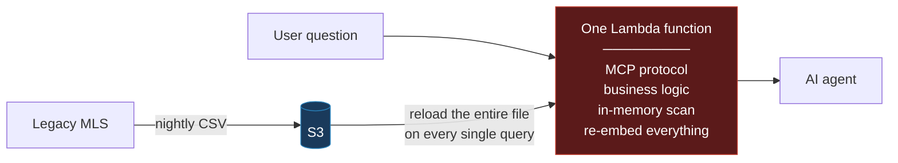
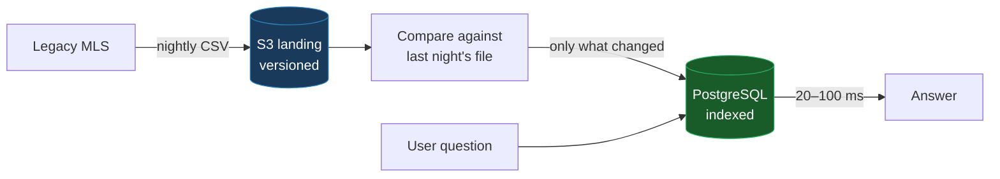
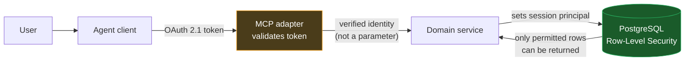

# Architecture Review

## A natural-language agent over legacy real-estate data, exposed via MCP

### How to read this document

Section 1 sets the scene and states every assumption I made, so you can challenge my inputs rather than my conclusions.

Section 2 summarises what the draft gets right and lists what it
gets wrong.

Section 3 takes each problem in turn — what the draft does, why it fails, and what I would put in its place.

Section 4 assembles the pieces into one architecture with its
costs and safeguards. 

Section 5 covers delivery. 

Section 6 concludes.

Technical terms are explained where they first appear. A non-technical reader should be able
to follow the argument end to end without skipping.

---

# 1. Context and assumptions

## 1.1 The situation

A real-estate brokerage wants staff to ask questions of their own data in plain English —
*"which three-bedroom condos under $500,000 have been sitting more than ninety days?"* — and
to act on the answers, through an AI agent.

The data lives in an MLS. A **Multiple Listing Service** is the cooperative database that US
brokerages use to publish and share listings; there are roughly 500–600 regional instances,
run by realtor associations. These systems are frequently decades old. The standard way to
get data out of one is a nightly file export. There is no live API to query.

For example Zillow, Redfin and Realtor.com all consume MLS data this
way. The architecture must accept nightly batch as a given and be excellent anyway.

## 1.2 The constraints, and what each one actually forces

| The constraint | What it forces on the design |
|---|---|
| ~3 million records, growing ~5% per month | Compounding is faster than it reads: 3M → **5.4M in a year → 9.7M in two**, doubling roughly every 14 months. Anything that merely *fits* today is scheduled to fail. |
| Raw records must never leave the client's AWS account or region | Rules out third-party hosted databases entirely. Constrains which AI models may be used and where they run — **including on the client side**, which is easy to miss. |
| Monthly infrastructure budget is capped | Cost control must be built into the architecture, not written into a runbook. |
| The legacy system offers only a nightly batch export | Data freshness is capped at 24 hours and must be *shown*, not hidden. Writes cannot travel back in real time. It is also, unexpectedly, a cost advantage. |
| Query latency must feel conversational | A few seconds, end to end. |

## 1.3 Assumptions I am making explicit

The brief leaves one thing unspecified that changes nearly every decision downstream. Rather
than assume quietly and hope, I am stating my reading — and I have designed for the
alternative in case I am wrong.

**Assumption 1 — The nightly export is a CSV of structured records.**

**Assumption 2 — Therefore the data has no substantial free text.** Prices, bedroom counts,
addresses, statuses, dates. Facts in columns, not prose.

This second assumption is the one that removes vector search from the design altogether, so
it carries real weight. §3.3 explains the reasoning, and gives the precise condition under
which I would reverse the decision.

**Assumption 3 — Realistic figures where the brief gives none:** ~1–2 KB per record (so a
3–6 GB nightly file), 0.5–2% of records changing each night, and roughly 1,000 queries a day
for costing purposes.

---

# 2. What the draft gets right, and what it gets wrong

## 2.1 Starting with what works

A review that finds nothing good is usually a review that did not read carefully. The draft
gets several things right, and I am keeping them:

**Exporting nightly to S3 is correct.** It is the only interface the legacy system offers,
and Amazon S3 is exactly the right place to land it: cheap, durable, and versioned. Keeping
every historical export gives a replayable audit trail — if the database is ever corrupted or
the schema needs rethinking, it can be rebuilt from scratch. That is a genuinely good
instinct and I would not change it.

**Choosing AWS Lambda as the compute layer is reasonable.** Lambda runs code on demand
without a server to maintain, and bills only for what runs. For traffic that is bursty and
modest, that is the right economic shape. My objection is not to Lambda; it is to putting
*everything* in one Lambda.

**Choosing MCP as the interface is right.** The Model Context Protocol is the emerging
standard for how AI agents call external tools. Building to it means the client is not locked
to one AI vendor.

So the disagreement is not about the ingredients. It is about how they are assembled.

## 2.2 The one mistake underneath most of the others

Four of the five listed problems are the same error wearing different clothes:

> **The design has no boundary between *receiving* data and *serving* it. It treats the
> nightly export file as though the file itself were the database.**

A file is a delivery mechanism. A database is a query engine — it indexes, it seeks directly
to the rows you asked for, it holds state between requests. The draft never converts one into
the other, so every query pays the full cost of the conversion, over and over.

Once that boundary is missing, everything else follows: the slow scan, the exhausted memory,
the recomputed embeddings, the runaway cost. They are not five bugs. They are one absent
boundary and its consequences.

## 2.3 The problems, in brief

Each is examined in §3. I have graded them by confidence, because they are **not** equally
severe, and saying so is part of an honest review — treating every item as equally damning is
what you do when you are pattern-matching rather than thinking.

| # | Problem | Confidence |
|---|---|---|
| 1 | The export file is being used as the database | **High** |
| 2 | Vector search does not belong in this system at all | **High** — *and not on the original list* |
| 3 | Embeddings are recomputed on every query | **High** — *a consequence of 1 and 2* |
| 4 | No authentication layer | **High** |
| 5 | The MCP server and business logic share one function | **Medium** — *a judgment call, not a defect* |
| 6 | No write path, and no handling of stale data | **High** |
| 7 | The residency rule is violated on the client side, invisibly | **High** — *not on the original list* |

Two of these were not in the brief. Finding them is, I think, the most useful thing this
review does.

---

# 3. The problems, and what I would do instead

## 3.1 The current design

Everything happens in one place, on every request, from cold.

---

## 3.2 Problem 1 — The export file is being used as the database

### What the draft does

On every user question, a Lambda function downloads the entire nightly export from S3, holds
it in memory, and searches it by reading through it from top to bottom.

### Why this fails

**It does not merely run slowly. At the stated data volume, it cannot run at all.**

A 3 GB CSV file does not occupy 3 GB once loaded into a program. Text parsed into a
programming language's internal objects typically expands **three to ten times** — so a 3 GB
file becomes **15–30 GB of memory**. AWS Lambda has a hard ceiling of 10 GB. The design
crosses that ceiling before it ever reaches 3 million records.

The trap is that the file *looks* like it fits. Nothing in the design signals the problem
until it fails in production.

Three further consequences deserve naming:

**CSV cannot be read selectively.** A CSV has no schema, no types, no index and no
compression. To answer *"how many listings are in Austin?"* the program must read and parse
every byte of every row — including all the columns it does not need. This is not an
implementation weakness that better code could fix. The file format itself makes selective
reading impossible.

**The latency is erratic rather than uniformly slow, which is worse.** Lambda reuses a warm
environment when requests arrive close together. So some questions return in a fraction of a
second, and others take forty. For a conversational interface, unpredictability is more
damaging than consistent slowness: users adapt to a system that is always slow, but they lose
trust in one that *sometimes* hangs, because they can never tell which they are about to get.

**The waste is measurable in money.** Holding 10 GB of Lambda memory for roughly 40 seconds
costs about **$0.007 per query** — for the file loading alone, before any useful work. At
1,000 queries a day that is **roughly $210 a month spent re-reading a file that has not
changed since the small hours of the morning.**

### The fix — separate receiving from serving

Keep the nightly export exactly as it is. Add the missing boundary behind it.

A nightly job compares the new export against the previous one, works out what actually
changed, and updates only those rows in a real database — **Amazon Aurora Serverless**, a
managed PostgreSQL that scales its capacity with demand and lives inside the client's own
network.

Two properties matter here.

**Only the changes are processed.** The export is a full dump, but real churn is small — a
brokerage does not re-list its entire inventory every night. At 0.5–2% change, that is roughly
15,000–60,000 records rather than 3 million. The nightly job becomes minutes of work instead
of an ever-growing burden.

**Queries stop paying for the file.** A database with proper indexes seeks directly to the
matching rows. The question *"three-bed condos under $500,000 in these ZIP codes, listed more
than 90 days"* becomes an indexed lookup returning in **20–100 milliseconds**, at 3 million
rows or at 10 million.

> **A note on the file format.** The brief says the legacy system exposes no real-time API.
> It does *not* say we cannot influence what goes *inside* the nightly file. Asking for
> **Parquet** instead of CSV — a columnar format that is 5–10× smaller, carries types, and
> permits reading only the needed columns — or simply asking for an `updated_at` timestamp
> column, would turn the nightly comparison from a file-diffing exercise into a trivial
> filter. It costs one conversation, and it is the kind of request nobody makes because they
> read the constraint as more rigid than it is.

---

## 3.3 Problem 2 — Vector search does not belong in this system

**This problem was not in the brief.** The listed item is that embeddings are recomputed on
every query, which frames the issue as an efficiency bug. I believe the real problem sits one
level above that.

### What "vector search" means, briefly

Modern AI can convert a passage of text into a list of numbers — an **embedding** — arranged
so that texts with similar *meaning* end up with similar numbers. This lets a system find
documents that are conceptually related even when they share no words. It is the technology
behind "search by meaning," and it is genuinely powerful for prose.

### Why it fails here

**It is being applied to data that has no prose in it.**

Consider a record: `{price: 450000, bedrooms: 3, city: "Austin", status: "active"}`. Those
are exact, unambiguous facts. Converting them into a similarity score takes information that
was *precise* and makes it *approximate*.

The practical consequence: asked for listings under $500,000, a vector search will
cheerfully return a $530,000 property, because the two descriptions are numerically similar
in meaning-space. It is not broken — it is doing exactly what it was designed to do. It is
simply the wrong instrument. **For a compliance-sensitive client, an answer that is
confidently and subtly wrong is worse than no answer**, because nobody catches it.

And in the other direction: *"which listings mention foundation problems?"* cannot be
answered by any technology whatsoever if the export contains no descriptive text. The
capability vector search would provide is not merely inefficient here — it has nothing to
operate on.

### The underlying error

The draft follows a chain of reasoning that has become almost automatic:

> natural-language interface → retrieval-augmented generation → vector database

For text, that chain is right. For a table of structured facts, the correct chain is:

> natural-language interface → **the model chooses a pre-approved query and fills in its
> parameters**

The AI's job is to translate *"three-bed condos under $500k sitting over 90 days"* into a
**function call** — `search_listings(bedrooms=3, max_price=500000, min_days_on_market=90)` —
not into a vector. The database then answers exactly, the way databases have answered exactly
for fifty years.

### The fix — remove it, and state exactly what would bring it back

I would delete vector search from this design. What replaces it:

- **Structured queries** through a small set of vetted, parameterised tools.
- **`pg_trgm`**, a standard PostgreSQL extension, for fuzzy matching on names and addresses —
  so *"the Riverside Oaks property"* still resolves when the user misremembers the exact name.
  This handles the genuine fuzzy-matching need without embeddings, at no cost.

**And here is the condition under which I would reverse this**, stated up front so the
decision is auditable rather than dogmatic:

| If the real export contains… | Then |
|---|---|
| Only structured fields *(my assumption)* | No embeddings. Relational queries plus `pg_trgm`. |
| Substantial free text — `PublicRemarks`, `PrivateRemarks`, agent notes | Add `pgvector` **into the same database**: one extension, one column, one index. Embeddings computed **once when a record changes**, never per query. |
| Attached documents — disclosures, inspection reports | A document extraction and chunking pipeline; and re-examine the database choice past roughly 10 million chunks. |

The middle row is likely in a real engagement. The **RESO Data Dictionary** — the industry
standard defining MLS fields — includes `PublicRemarks` and `PrivateRemarks`, the descriptive
text agents write. A genuine MLS feed probably carries them.

> **This is the real reason I chose PostgreSQL, and it is a stronger reason than any
> benchmark: it lets us not decide yet.**
>
> If descriptive text turns out to be present, adding vector search is an extension and a
> column — a day's work, no migration. If it never appears, we never paid for a specialised
> database we did not need. A dedicated vector database forces that decision *now*, on a
> dataset that may never justify it.
>
> Choosing PostgreSQL is not choosing vectors. It is **buying the option to have vectors, for
> free.** That is a far more defensible position than "everyone uses Pinecone" — and the
> residency rule rules out hosted vector databases regardless, since the records would leave
> the client's account.

---

## 3.4 Problem 3 — Embeddings are recomputed on every query

### What the draft does

Every user question triggers the regeneration of embeddings for the entire dataset.

### Why this fails

Purely arithmetically: 3 million records at roughly 150 words of text each is about 450
million units of text to process. At Amazon's current embedding price ($0.02 per million),
that is **approximately $9 for a single user question.**

Ten questions would exhaust a month of most small-business infrastructure budgets. The
processing time would be measured in hours, not the few seconds required.

But the arithmetic is not the interesting part. **The structural reason is.**

Look again at the draft: there is no database anywhere in it. There is a file in S3, and
there is the temporary memory of a Lambda function that is discarded the moment the request
finishes. **There is nowhere for computed embeddings to be stored.** The recomputation is not
carelessness — it is *forced* by the missing boundary from Problem 1. With no persistent
store, nothing can persist.

This is why I framed Problems 1, 2 and 3 as one root cause rather than three findings.

### The fix

Two things resolve it, and neither is a caching optimisation:

1. **Embeddings are a property of the record, not of the question.** They are computed once,
   when a record changes, and stored beside it. Only the *user's question* is converted at
   query time — a single operation taking milliseconds and costing a fraction of a cent.
2. **In this design, they are not computed at all**, because §3.3 removed them.

So the honest answer to this item is: *the fix is not to cache the embeddings. It is to
delete them.* And that reframes the cost figure — **the draft was not overspending on a
poorly built feature. It was spending $9 a query on a feature that should not exist.**

---

## 3.5 Problem 4 — No authentication layer

### What the draft does

Defers authentication: *"we'll add it later once the demo works."*

### Why this fails

This is the item most likely to be waved through, and the one I would resist hardest. It is
wrong in three independent ways.

**First, authentication is not a layer you add on top. It is a property of the data
layer.** The question "which records may this person see?" becomes a filter inside *every
single query the system makes*. Bolting it on afterwards does not mean inserting a component
in front — it means rewriting the data access code that was just written, because none of it
was built to carry the notion of *who is asking*. The "later" is not a small later.

**Second, an unauthenticated MCP server is an open data-exfiltration endpoint.** An MCP
server is reachable over the network by design — that is its purpose. One without
authentication is a public interface to three million confidential client records. In a
compliance-bound industry, that is not technical debt. It is a reportable incident waiting to
be discovered.

**Third — and most practically — the demo's real audience is the compliance team.** They are
the people who can stop this project in month three. A demonstration with no access controls
does not get their approval, which means the shortcut fails to buy the very thing it was
taken for.

### The deeper issue: the agent must act *as the user*

There is a subtler failure that matters specifically for AI agents, called the **confused
deputy**.

If the system connects to the database using a single all-powerful account, then the AI is a
deputy holding universal keys. A user who is only entitled to their own office's listings can
phrase a request that persuades the agent to fetch another office's — and the agent, having
the keys, complies. The security model was never wrong at the database; it was bypassed at
the conversation.

The MCP specification names this failure explicitly and forbids the pattern that causes it.

### The fix — identity travels all the way down

The user's verified identity is carried from the front door to the database, where
**PostgreSQL Row-Level Security** enforces it. RLS is a database feature that attaches a
permission rule to a table itself: even a query that forgets to filter by office cannot
return another office's rows, because the database refuses. The safety net sits *below* the
application code rather than inside it.

> **The rule I would hold under any pressure:** the permission filter is derived on the
> server from the verified token, and is **never** something the AI can supply as a
> parameter. The model may choose *what* to ask. It may never choose *whose data to ask
> about*.

Alongside this: an audit log of every tool call — who asked, what they asked, what came back.
Compliance will require it eventually, and it is far cheaper to build in than to
retrofit.

---

## 3.6 Problem 5 — The MCP server and the business logic share one function

**I grade this one lower than the others, deliberately.** It is a real concern, but it is a
judgment call rather than a defect, and I think an honest review should say which is which.

### Why the obvious argument is not good enough

The reflexive justification is "separation of concerns." That invites a fair objection, and
one I would agree with:

> *You have a small team building a first version. You want two services, a network hop
> between them, two sets of permissions and two deployment pipelines — to get a boundary that
> a module import already gives you?*

Splitting a system into services on principle, before anything forces it, is exactly the
over-engineering this review argues against elsewhere. Being inconsistent about that would
undermine the rest of the document.

### What the real problem is

**The flaw is that there is no boundary at all — not that both things run in one place.**

Three things genuinely justify separating them here:

**Everything is locked behind MCP.** With no internal boundary, the query and action logic
can only be reached by speaking the MCP protocol. No web dashboard, no scheduled report, no
second agent, and no way to test the business rules without standing up a protocol session.
In a real brokerage there will be a dashboard within six months, and it will need the same
`search_listings` logic that already exists.

**Blast radius.** Code that parses untrusted input from the network sits in the same
execution environment, with the same database permissions, as the code that reads client
data. Separated, the protocol adapter holds no data permissions of its own — it verifies who
is calling and forwards the request. This composes directly with the authentication fix
above.

**The protocol is still moving.** MCP has shipped several significant revisions to its
transport and authorisation model within a year. Fusing business logic to a specification
that is still changing means every protocol update forces re-testing of business rules that
did not change.

### The fix

A firm **internal boundary from day one**: the domain logic is an independently callable,
independently testable layer with its own typed interface and no knowledge that MCP exists.

Whether it deploys as a separate process is a *topology* decision, driven by the security
boundary and the number of consumers — not by principle. I would begin with both behind that
interface and separate them when the second consumer or the compliance review arrives. From a
proper boundary, that separation is a configuration change rather than a rewrite.

This is the distinction I would want to be judged on: **a code boundary and a deployment
boundary are different things, and only one of them is free.**

---

## 3.7 Problem 6 — No write path, and no handling of stale data

Two omissions, both consequential, neither mentioned in the draft.

### The system cannot act, only answer

The brief asks for an agent that can *query and **act on*** the data. The draft only returns
search results. And the legacy system is read-only batch — there is no API to write back to.
So where do actions go? The design has no answer.

**The fix** splits actions in two:

- **Actions that live entirely in the new system** — flag a listing, create a follow-up task,
  draft outreach. Full read-write, immediate, no dependency on the legacy system.
- **Actions that must eventually reach the legacy system** — written to an *outbox*, a queue
  of pending changes, dispatched during the batch write-back window, with their status
  visible to the user rather than silently pending.

And a rule: **consequential actions return "pending approval," not "done."** In a
compliance-bound industry, an agent that autonomously modifies the system of record is not a
feature — it is an audit finding. A human confirms; the agent prepares.

### The system will state stale facts confidently

Data is up to 24 hours old, and nothing in the draft surfaces that. So the agent will report
yesterday's price as today's, in the same confident tone it uses for everything else.

**The fix** is cheap and disproportionately valuable: every tool response carries an `as_of`
timestamp, and the agent is instructed to state data currency when it matters. *"As of last
night's 2 a.m. sync"* costs one clause and buys the user a calibrated sense of when to
double-check.

---

## 3.8 Problem 7 — The residency rule is violated where nobody is looking

**This one is also not in the brief, and it is the finding I would most want the compliance
team to see.**

The requirement is that raw records never leave the client's AWS account. Every version of
this architecture — the draft's and mine — satisfies that *on the server*.

But consider what actually happens when a question is asked.

**The MCP server never calls an AI model. The client does.** The MCP server's job is to
answer tool calls with data. It is the *agent application* — the thing the user talks to —
that sends those records into a language model to compose a reply.

Which means **the records leave the account at the client boundary, not the server
boundary.** A perfectly designed server, fronted by a desktop AI application running on an
agent's laptop and calling a third-party model, violates the residency requirement completely
— and every architecture diagram of the server would still look immaculate.

```mermaid
flowchart LR
  subgraph acct["Client AWS account — compliant"]
    DB[("Database")] --> MCP["MCP server"]
  end
  MCP -->|"records"| CL["Agent client"]
  CL -->|"records in the prompt"| EXT["Third-party AI model<br/>OUTSIDE the account"]

  style EXT fill:#5b1a1a,stroke:#c0392b,color:#fff
  style acct fill:#0f2f1a,stroke:#27ae60
```

**The fix:** the agent client must also run inside the account, against a model hosted there —
Amazon Bedrock reached over a private network endpoint. Bedrock is AWS-managed and runs
in-region, so the network path is solvable; but whether that satisfies "never leaves our
account" is a **compliance judgment, not an engineering one.** I would get it answered in
writing in week one, because the answer changes which models are available.

---

# 4. The revised architecture

## 4.1 The whole picture

```mermaid
flowchart TB
  subgraph legacy["Legacy MLS — unchanged"]
    L["Nightly CSV export"]
  end

  subgraph aws["Client AWS account · one region · no internet egress"]
    S3[("S3 landing<br/>versioned history")]
    ING["Ingest Lambda<br/>compare → update changes only<br/>circuit breaker"]
    DB[("Aurora Serverless PostgreSQL<br/>indexed · Row-Level Security")]
    MCP["MCP adapter<br/>no database permissions"]
    DOM["Domain service<br/>vetted, typed tools"]
    AG["Agent client<br/>Bedrock · in-account"]
    COG["Cognito<br/>OAuth 2.1"]
  end

  L -->|"overnight"| S3
  S3 --> ING --> DB
  AG -->|"MCP over HTTPS"| MCP
  COG -.->|"verified identity"| MCP
  MCP --> DOM --> DB

  style DB fill:#1a5b2a,stroke:#27ae60,color:#fff
  style S3 fill:#1a3a5b,stroke:#2980b9,color:#fff
  style aws fill:#0f2f1a,stroke:#27ae60
```

## 4.2 What stays and what changes, at a glance

| Draft | Revised | Why |
|---|---|---|
| The file *is* the database | Nightly pipeline: land → compare → update | Restores the missing boundary |
| Vector search over structured rows | **Removed.** Vetted parameterised queries | Precision; wrong instrument for the data |
| Re-embed everything per query | No embeddings at all | ~$9/query → $0 |
| In-memory scan of the whole file | Indexed database queries | 40 s → 20–100 ms |
| Authentication "later" | Identity → token → row-level security, day one | Authorisation is a data-layer property |
| One function holds everything | Internal boundary; thin protocol adapter | Reuse, testability, blast radius |
| No way to act | Outbox with human approval | The brief asks for action |
| Silent staleness | `as_of` on every response | Calibrated trust |
| *(unexamined)* | Agent client runs in-account | Residency actually holds |

**One clarification, because it is often misread:** "the model chooses a query" does **not**
mean the model writes SQL. It selects among a handful of pre-approved, parameterised tools
and fills in typed arguments. Free-form SQL generation invites invented table joins,
misunderstood columns, unbounded scans, and an authorisation hole — a model writing its own
filter can omit the one that limits it to the user's own office. If genuinely open-ended
analysis is needed later, generated SQL can be added as a deliberate, fenced escape hatch:
read-only account, enforced timeout, row limit, row-level security still applied, every query
logged. Never the default path.

## 4.3 Safeguards

Because the budget is capped and the data is confidential, controls belong *in the
architecture*, not in a document somebody is supposed to read.

**Cost**

- A budget alarm that notifies before, not after
- **A ceiling on database capacity.** Aurora scales automatically with load — which is
  excellent, and is also how organisations discover five-figure invoices. The maximum must be
  set deliberately.
- Concurrency limits on Lambda, so a runaway loop cannot bill without bound
- Lifecycle rules on stored exports — ninety full historical snapshots is not an audit trail,
  it is a storage bill
- **Cached answers valid until the next nightly load.** Data changes once a day, so a
  24-hour cache is not reckless here — it is *provably correct*. The constraint everyone
  reads as a limitation turns out to be the strongest cost lever in the design.
- **No NAT Gateway.** Using private AWS network endpoints instead saves roughly $32 a month
  *and* means traffic never touches the public internet — which is itself the residency
  argument, made structural.
- Cost-allocation tags, so spend can be attributed per client office

**Security**

- Separated, least-privilege permissions — the protocol adapter's role cannot reach the
  database at all
- Row-level security tied to the verified identity
- No raw SQL surface exposed to the model
- Human approval on consequential actions
- Query timeouts and row limits on everything
- A full audit log of tool calls
- Content and PII filtering on model interactions

**Operational — the one I would draw attention to**

- **An ingest circuit breaker.** If tonight's export differs from last night's by more than a
  set percentage, the pipeline **stops and raises an alarm** instead of processing it.

  A truncated or corrupted export from a decades-old system is not a hypothetical. Without
  this control, one bad file silently overwrites the entire dataset and consumes the budget
  processing garbage — and the first person to notice is a user getting wrong answers. This
  is the kind of safeguard that only appears in systems whose owners have been burned once.

## 4.4 What it costs, and where the time goes

| Component | Monthly |
|---|---|
| Aurora Serverless PostgreSQL (0.5–2 capacity units) | ~$45–150 |
| S3 storage (~5 GB plus history) | <$5 |
| Lambda (adapter, domain service, nightly ingest) | ~$10–30 |
| Embeddings | **$0** — removed |
| NAT Gateway | **$0** — private endpoints only |
| **Infrastructure floor** | **~$60–185** |
| AI model inference | The dominant variable; scales with usage and model choice |

| Where a query's time goes | |
|---|---|
| Request and authentication | ~50 ms |
| Indexed database query over 3M rows | ~20–100 ms |
| **AI model generating the reply** | **1–3 s** |

**The comparison that matters:** the draft spends roughly **$9 per query on embeddings
alone** — approximately the *monthly* infrastructure cost of the revised design, consumed by
a single question. Plus about **$210 a month** re-reading an unchanged file.

**And a note on where to optimise:** once the data layer is fixed, the AI model accounts for
80–90% of response time. Everything else is noise. That is worth knowing before anyone
proposes spending a sprint making the database faster.

*All figures are order-of-magnitude estimates, to be re-verified for the deployment region at
the time of build.*

---

# 5. Delivery

## 5.1 Prior MCP integration

> **[TO BE COMPLETED — this section is the author's own professional experience and has
> deliberately not been drafted for them.]**
>
> Name one real integration: what system it fronted, what the tools exposed, who consumed it,
> and one thing that proved harder than expected. If it was not literally MCP — an agent
> wired into an internal system, tool-calling over a legacy API, a function-calling layer over
> a database — say so plainly and describe the equivalence. Specifics beat protocol purity.

## 5.2 How I would structure the first two weeks

The plan is organised around **eliminating the unknowns that could invalidate this
architecture**, not around shipping features. Two things could force a redesign, and both are
answerable within days. I would answer them first.

### Week one — remove the ambiguity, prove one path end to end

**Day 1 — the compliance ruling.** Does "never leaves our account" permit Amazon Bedrock —
AWS-managed and in-region, but outside the client's own network boundary? A private endpoint
solves the network path; whether that satisfies the policy is a legal judgment. I want it in
writing, because it determines which models are available. In the same conversation: the
client-side boundary from §3.8, which they will not have considered.

**Days 1–2 — get a real export file.** Not a specification of one: the actual file. Profile
it. What is its true size, its real schema, does it contain descriptive text, and how much
changes between two consecutive nights? **This single artifact confirms or destroys the
central assumption of this document.** While the relationship is fresh, ask for Parquet and
an `updated_at` column.

**Days 2–3 — authentication and schema together**, because they are one decision, not two.
Tenancy model, row-level security policy, how identity claims map to database permissions.

**Days 3–5 — one authenticated slice, end to end.** One tool, one query, real data, real
identity, real database. Not a mock.

*Exit criterion: a compliance officer can look at it and say yes or no.*

### Week two — correctness, the ability to act, and cost visibility

**Days 6–7 — a golden question set.** Roughly 25 real questions from actual brokerage staff,
with known-correct answers. This becomes the regression suite, and it converts arguments
about quality from opinion into evidence.

**Days 7–8 — harden the ingest.** Full change detection, the circuit breaker, and metrics on
records changed and cost per run.

**Days 8–9 — the write path.** Outbox, approval workflow, status surfaced back to the user.

**Day 9 — cost controls into infrastructure-as-code**, asserted by automated tests rather
than merely configured. A safeguard nobody verifies is a safeguard that quietly disappears in
the third sprint.

**Day 10 — demonstrate to the compliance team**, not only the project sponsor. They are the
ones who can halt this in month three; involving them at the end is how projects die late.

**Team shape:** two engineers — one on data and ingestion, one on the API and MCP layer — plus
a part-time security or compliance reviewer *from day one* rather than as a gate at the end. I
would carry the architecture and the client conversations.

**What I would deliberately not do in two weeks:** multi-tenant onboarding, a user interface,
more than a handful of tools, or any performance work beyond confirming the latency budget
holds. The goal at day ten is a system that is **provably safe, provably correct on a known
set of questions, and honest about what it does not know** — not a broad one.

---

# 6. Conclusion

The draft is not the work of someone careless. It gets the ingredients right — nightly export
to S3, serverless compute, MCP as the interface — and its instincts about the shape of the
problem are sound. What it lacks is a boundary in one place and a question in another.

**The boundary** is between receiving data and serving it. Adding it resolves most of the
listed problems at once: the memory ceiling, the erratic latency, the recomputation, and the
majority of the cost. The nightly export stays exactly as it is; it simply stops pretending
to be a database.

**The question** is whether this system needs vector search at all. My reading of the brief
says it does not, because the data is a table of facts rather than a body of prose — and
applying similarity search to exact facts trades away the precision the client is paying for.
That is the boldest recommendation here and the one I would defend hardest, which is why
§3.3 states the exact condition that would reverse it. The database choice keeps that reversal
free.

Two further findings were not in the original list. The system as specified **cannot act on
anything**, though the brief asks for action. And the residency requirement is **violated on
the client side**, invisibly, in every diagram that only draws the server.

What I would want a reader to take from this is not a list of corrections. It is a way of
deciding:

> **Natural language is the interface. It is not the execution engine.**

The AI should understand what someone means and choose the right pre-approved question. The
database should answer it exactly. Keeping those two responsibilities separate is what makes
the system fast, affordable, auditable, and safe enough for a compliance team to sign — and
it is what the draft, understandably, conflated.

---

*Assumptions in §1.3 are the load-bearing inputs to everything above. If any of them is
wrong, the affected recommendation is flagged in place with the condition that would change
it. I would rather be corrected on an input than be right for the wrong reason.*
