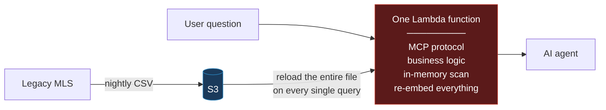
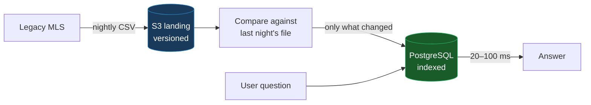
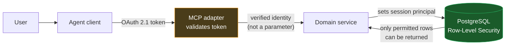

# Architecture Review

## A natural-language agent over legacy real-estate data, exposed via MCP

Section 1 states the assumptions, so you can challenge my inputs rather than my conclusions.
Section 2 covers what the draft gets right and the error underneath what it gets wrong.
Section 3 takes each problem in turn — what the draft does, why it fails, what replaces it.
Section 4 assembles the architecture with its costs and safeguards. Section 5 is the first
two weeks. Technical terms are explained where they first appear.

---

# 1. Context and assumptions

## 1.1 The situation

A real-estate brokerage wants staff to ask questions of their own data in plain English —
*"which three-bedroom condos under $500,000 have been sitting more than ninety days?"* — and
to act on the answers.

The data lives in an MLS. A **Multiple Listing Service** is the cooperative database US
brokerages use to publish and share listings; there are roughly 490 regional instances, run by
realtor associations, frequently decades old [[10]](#refs). The standard way to get data out of
one is a nightly file export. There is no live API. Zillow, Redfin and Realtor.com all consume
MLS data this way. The architecture must accept nightly batch as a given and be excellent
anyway.

## 1.2 The constraints, and what each one forces

| The constraint | What it forces on the design |
|---|---|
| ~3M records, growing ~5% per month | Compounding is faster than it reads: 3M → **5.4M in a year → 9.7M in two**, doubling roughly every 14 months. Anything that merely *fits* today is scheduled to fail. |
| Raw records must never leave the client's AWS account or region | Rules out third-party hosted databases. Constrains which models may be used and where they run — **including on the client side**, which is easy to miss. |
| Monthly infrastructure budget is capped | Cost control belongs in the architecture, not in a runbook. |
| Nightly batch export only | Freshness is capped at 24 hours and must be *shown*, not hidden. Writes cannot travel back in real time. It is also, unexpectedly, a cost advantage. |
| Conversational latency | A few seconds, end to end. |

## 1.3 Assumptions

**1 — The nightly export is a CSV of structured records.** The brief says "data dump" and
"~3 million records," and describes searching it "in memory." Nobody calls a PDF a record.
This is the load-bearing assumption; Section 5 puts settling it on day one.

**2 — The corpus is mixed, and the two halves need different treatment.** The structured
export is prices, bedroom counts, addresses, statuses and dates. But a real listing file also
carries **documents**: HOA rules, seller disclosures, inspection reports. These are prose, and
they answer a class of question the columns cannot. This split is the most consequential
judgment in the review. It does not remove vector search — it decides **what gets embedded
and what never should** (Section 3.3).

**3 — The user is a broker inside the brokerage, not a consumer.** The brief says the client
wants staff to query *their* data and act on it: internal operations, not a public property
portal. This fixes the tenancy model — every request belongs to one brokerage, and that
scoping runs down to the database (Section 3.5).

**4 — Realistic figures where the brief gives none:** ~1–2 KB per record (a 3–6 GB nightly
file), 0.5–2% of records changing each night, ~1,000 queries a day for costing.

---

# 2. What the draft gets right, and what it gets wrong

## 2.1 What works

**Exporting nightly to S3 is correct.** It is the only interface the legacy system offers,
and S3 is the right place to land it: cheap, durable, versioned. Keeping every historical
export gives a replayable audit trail — if the database is corrupted or the schema needs
rethinking, it can be rebuilt.

**Lambda is a reasonable compute layer.** It bills only for what runs, which suits bursty,
modest traffic. My objection is not to Lambda; it is to putting *everything* in one Lambda.

**MCP is the right interface.** It is the emerging standard for how agents call external
tools, so the client is not locked to one AI vendor.

The disagreement is not about the ingredients. It is about how they are assembled.

## 2.2 The one mistake underneath most of the others

Four of the five listed problems are the same error in different clothes:

> **The design has no boundary between *receiving* data and *serving* it. It treats the
> nightly export file as though the file itself were the database.**

A file is a delivery mechanism. A database is a query engine — it indexes, it seeks directly
to the rows you asked for, it holds state between requests. The draft never converts one into
the other, so every query pays the full cost of the conversion. Once that boundary is
missing, everything else follows: the slow scan, the recomputed embeddings, the cost.

---

# 3. The problems, and what I would do instead

## 3.1 The current design

Everything happens in one place, on every request, from cold.

## 3.2 Problem 1 — The export file is being used as the database

**What the draft does.** On every question, a Lambda downloads the entire nightly export from
S3, holds it in memory, and reads it top to bottom.

**Why this fails.** I built both designs and measured them on 2.2 million real listing
records. Raw output is in `demo/results/benchmark.json`.

| Records | Draft design | Revised design |
|---:|---|---|
| 10,000 | 61 ms · $0.03/query | 36 ms |
| 100,000 | 610 ms · $0.30/query | 33 ms |
| 500,000 | 2,784 ms · $1.50/query | 31 ms |
| 1,000,000 | 5,483 ms · $3.00/query | 31 ms |
| **2,221,849** | **11,991 ms · $6.67/query** | **33 ms** |

**Read the right-hand column first.** It does not move — 33 ms at ten thousand records and
33 ms at two million, because an indexed lookup does not care how much data it is *not*
looking at. The left-hand column grows in a straight line, because a full scan cares about
nothing else. At the brief's 3 million records the draft extrapolates to roughly **16 seconds
and $9 per question**, against a stated budget of "a few seconds" and a capped bill.

**A correction from my own measurements.** I expected memory to be the wall: a multi-gigabyte
file parsed into program objects expands several times over, and Lambda is capped at 10,240 MB
[[2]](#refs). Measured, the expansion is real but the base is smaller than assumed — about
1.9 GB at 3M records, reaching the ceiling only at **16.4 million**, roughly 35 months out at
5% growth. So the honest finding is not that the draft cannot run. It is that **it becomes too
slow and too expensive years before it becomes impossible**, and it gives no warning as it
degrades. Lambda's 15-minute hard timeout [[2]](#refs) is reached sooner than the memory
ceiling, but both are years behind the point where the design stops being usable.

Two further consequences:

**CSV cannot be read selectively.** No schema, no types, no index, no compression. To answer
*"how many listings are in Austin?"* the program must parse every byte of every row,
including columns it does not need. Better code cannot fix this; the format forbids it.

**The latency is erratic rather than uniformly slow, which is worse.** Lambda reuses a warm
environment when requests arrive close together, so some questions return in a fraction of a
second and others take forty. Users adapt to a system that is always slow; they lose trust in
one that *sometimes* hangs, because they cannot tell which they are about to get.

### The fix — separate receiving from serving

Keep the nightly export exactly as it is. Add the missing boundary behind it.

A nightly job compares the new export against the previous one and updates only the rows that
changed, in **Amazon Aurora Serverless** — managed PostgreSQL that scales with demand and
lives inside the client's own network.

**Only the changes are processed.** The export is a full dump, but a brokerage does not
re-list its entire inventory every night. At 0.5–2% churn that is 15,000–60,000 records
rather than 3 million.

**Queries stop paying for the file.** *"Three-bed condos under $500,000 in these ZIP codes,
listed more than 90 days"* becomes an indexed lookup returning in 20–100 ms, at 3 million
rows or at 10 million.

---

## 3.3 Problem 2 — Everything is embedded, indiscriminately

The listed item is that embeddings are recomputed per query, which frames this as an
efficiency bug. There are **two separate mistakes**, with different fixes. This section is
*what* gets embedded; Section 3.4 is *when*.

**What vector search is.** A model converts a passage of text into a list of numbers — an
**embedding** — arranged so texts with similar *meaning* end up with similar numbers. That
lets a system find passages that are conceptually related even when they share no words. For
prose it is genuinely powerful. The word doing the work is *prose*.

**Why it fails here.** The draft embeds the whole dataset, but the dataset is not one kind of
thing. Consider `{price: 450000, bedrooms: 3, city: "Austin", status: "active"}`. Those are
exact facts. Converting them into a similarity score takes information that was *precise* and
makes it *approximate*. Asked for listings under $500,000, a vector search will return a
$530,000 property, because the two descriptions sit close together in meaning-space. It is
not broken; it is the wrong instrument. **For a compliance-sensitive client, an answer that is
confidently and subtly wrong is worse than no answer**, because nobody catches it.

**The underlying error.** The draft follows a chain that has become automatic:

> natural-language interface → retrieval-augmented generation → vector database

For prose that chain is right. For a table of facts the correct chain is:

> natural-language interface → **the model chooses a pre-approved query and fills in its
> parameters**

The AI's job is to translate *"three-bed condos under $500k sitting over 90 days"* into a
**function call** — `search_listings(bedrooms=3, max_price=500000, min_days_on_market=90)` —
not into a vector. The error is not *using* embeddings. It is applying one instrument to two
different kinds of data.

### The fix — route by the kind of data, not the kind of question

| Data | Path | Rule |
|---|---|---|
| Structured fields — price, bedrooms, ZIP, status, dates | **Exact SQL** through vetted, parameterised tools | Never embedded. Vectorising a price destroys the precision the client is paying for. |
| Documents — HOA rules, disclosures, inspection reports | **Vector search over chunked text** | Embedded **once when the document arrives**, never per query. |
| Names and addresses the user half-remembers | **`pg_trgm`**, a standard PostgreSQL extension | Fuzzy matching without embeddings, at no cost. |

Both live in the same PostgreSQL database, which is what makes the third case work.

### The questions that need both halves

A broker asks: *"Three-bed condos under $500,000 in Austin **that allow short-term
rentals**."* `three-bed`, `under $500,000`, `Austin`, `condo` are exact comparisons — SQL.
But *"allows short-term rentals"* is buried in the building's rules, phrased by a lawyer, and
never as a checkbox:

> *"Leases of fewer than 30 days are prohibited, except for units acquired prior to 2019,
> which may be let up to twice annually subject to Board approval."*

**Neither path answers this alone.** Vector search gets the price wrong; SQL cannot read the
paragraph. The answer is a **hybrid query**: filter exactly first, then rank semantically
within the filtered set — one round trip, because the vectors and the columns are in the same
database.

Two more of the same shape:

- *"Which of my listings sitting over 90 days have disclosed foundation issues?"* — the
  structured half tells you which are stale; the documents tell you **why**.
- *"Which active pre-1978 listings are missing a signed lead-paint disclosure?"* — a federal
  requirement carrying civil and criminal penalties of up to $10,000 per violation, plus
  treble damages [[9]](#refs). This one asks about a document that **is not there**, and
  similarity search has no concept of absence.

### "Why not just make these columns?"

The sharpest objection: if *"allows short-term rentals"* matters, why not extract it once and
store it as a field? For high-frequency, stably-defined facts, **you should**. Four things
stop it being the whole answer:

- **Nobody has done the extraction.** The MLS schema is set by the regional association, not
  the brokerage; you cannot add columns to someone else's system. The rules are a PDF somebody
  uploaded.
- **You can only structure what you anticipated.** Pending litigation, roof warranty, rental
  cap — every new question becomes a schema change and a backfill.
- **Conditional prose does not survive a boolean.** What is the value of
  `allows_short_term_rental` for that clause? Every possible answer is wrong, and the nuance
  destroyed is exactly the nuance the agent needs.
- **Citation.** An agent advising a buyer must be able to point at the paragraph. *"The system
  said yes"* is not a defence in a dispute; *"Section 8.3, here is the text"* is. A vector
  search returns the passage; a column returns `true`.

RESO does define fields of this kind. `PetsAllowed` is a real one, and it makes the point
better than I could: it is populated by only 65% of participating organisations, and one of
its eight permitted values is literally `Call` [[8]](#refs) — the schema conceding that the
answer does not fit in the field.

> **This is the real reason I chose PostgreSQL, stronger than any benchmark: the two halves
> live together.** `pgvector` is an extension, not a separate system. Filters and vectors sit
> in one table, so a hybrid query is one statement and one round trip. A dedicated vector
> database forces you to either over-fetch and filter afterwards, or filter and hope — and
> the residency rule excludes hosted vector databases anyway.
>
> One caveat, because it is the failure mode people meet in production: filtered vector search
> silently returns incomplete results unless `pgvector` 0.8's `iterative_scan` is enabled.
> Filtering is applied *after* the index is scanned, so with the default `ef_search` of 40 and
> a predicate matching 10% of rows, a request for ten results returns about four — no error, no
> warning [[7]](#refs). It is a one-line setting and it is not optional.

---

## 3.4 Problem 3 — Embeddings are recomputed on every query

**What the draft does.** Every question regenerates embeddings for the entire dataset.

**Why this fails.** 3 million records at roughly 150 words each is about 450 million words. At
Titan Text Embeddings V2's price of $0.02 per million tokens [[3]](#refs) that is
**approximately $9 for a single question** — and that is the conservative reading, since
English runs about 1.3 tokens per word, putting the true figure nearer $12. Ten questions would
exhaust a month of most small-business budgets, and the processing time would be measured in
hours.

But the arithmetic is not the interesting part. **There is nowhere in the draft to put an
embedding.** There is a file in S3 and the temporary memory of a Lambda that vanishes when
the request ends — no database, nothing that outlives a call. The recomputation is not
carelessness; it is *forced* by the missing boundary from Problem 1. With no persistent
store, nothing can persist. This is why Problems 1, 2 and 3 are one root cause with three
symptoms.

### The fix — embeddings belong to the document, not to the question

**An embedding is a property of the text, so it is computed when the text arrives, not when
someone asks about it.**

1. **At ingest, once.** A document lands, is split into passages, each passage is embedded,
   and the vectors are stored beside it — on the nightly pipeline, off the request path.
2. **On subsequent nights, only the delta.** A document whose content digest is unchanged is
   not re-read, not re-chunked, not re-embedded. Nightly work is proportional to what changed.
3. **At query time, one embedding.** The *user's question* — a few milliseconds, a fraction
   of a cent. Nothing else.
4. **Never for structured fields.** Those are compared, not embedded.

| | Draft | Revised |
|---|---|---|
| First load | — | **~$3, once** |
| Each night after | — | **cents** (only changed documents) |
| **Per user question** | **~$9** | **~$0.000004** |

The $9 does not become $2 through better engineering. It becomes effectively zero, because
the work was never supposed to happen at query time.

---

## 3.5 Problem 4 — No authentication layer

**What the draft does.** Defers authentication: *"we'll add it later once the demo works."*

**Why this fails.** This is the item most likely to be waved through, and the one I would
resist hardest. It is wrong in three independent ways.

**Authentication is not a layer you add on top. It is a property of the data layer.** "Which
records may this person see?" becomes a filter inside *every query the system makes*. Bolting
it on afterwards is not inserting a component in front — it is rewriting the data access code
that was just written, because none of it was built to carry the notion of *who is asking*.

**An unauthenticated MCP server is an open data-exfiltration endpoint.** An MCP server is
reachable over the network by design. One without authentication is a public interface to
three million confidential records. In a compliance-bound industry that is not technical
debt; it is a reportable incident waiting to be discovered.

**The demo's real audience is the compliance team.** They can stop this project in month
three. A demonstration with no access controls does not get their approval, so the shortcut
fails to buy the thing it was taken for.

### The agent must act *as the user*

There is a subtler failure specific to AI agents, the **confused deputy**. If the system
connects to the database using a single all-powerful account, the AI is a deputy holding
universal keys. A user entitled only to their own office's listings can phrase a request that
persuades the agent to fetch another office's — and the agent, having the keys, complies. The
security model was not wrong at the database; it was bypassed at the conversation.

The MCP specification names this failure explicitly and forbids the pattern that causes it:
servers **MUST** validate that a token was issued for them, **MUST NOT** accept or transit any
other token, and **MUST NOT** pass through the token received from the client to an upstream
API [[6]](#refs).

### The fix — identity travels all the way down

The verified identity is carried from the front door to the database, where **PostgreSQL
Row-Level Security** enforces it. RLS attaches a permission rule to the table itself: even a
query that forgets to filter by office cannot return another office's rows, because the
database refuses. The safety net sits *below* the application code rather than inside it.

> **The rule I would hold under any pressure:** the permission filter is derived on the server
> from the verified token, and is **never** something the AI can supply as a parameter. The
> model may choose *what* to ask. It may never choose *whose data to ask about*.

Alongside this, an audit log of every tool call — who asked, what they asked, what came back.
Compliance will require it eventually and it is far cheaper to build in than to retrofit.

---

## 3.6 Problem 5 — The MCP server and the business logic share one function

### What "business logic" means here

The phrase is vague enough to argue past, so: there are two genuinely different kinds of code.

**The protocol layer** knows about MCP — the JSON schemas describing each tool, the
request/response framing, how a result is wrapped, how an error becomes a protocol error. It
knows nothing about real estate.

**The business logic** is the policy. Which questions may be asked. What counts as a valid
price range or status. That a result set is capped at 200 rows and a query at five seconds.
That flagging a listing produces `pending_approval`, never `done`. That every response carries
an `as_of` timestamp. And most importantly: **that the tenancy filter is derived from the
verified identity and can never arrive as an argument.**

That second list is the client's actual rules — what a reviewer would audit, what compliance
would sign, and what must survive an MCP version upgrade untouched.

### There are two boundaries here, and they do different jobs

The draft is missing both, and they are not substitutes.

**The code boundary — separation of concerns.** Necessary, not stylistic. With the layers
fused, the business rules can only be reached by speaking MCP: no way to call
`search_listings` from a scheduled report, a dashboard, or a second agent; no way to test the
rules without standing up a protocol session; and every MCP revision — the specification has
shipped several significant ones inside a year — forces re-testing of rules that did not
change.

**The privilege boundary — the one no amount of clean code can give you.**

> **A Lambda function has exactly one execution role.**

If the protocol handler and the data access run in the same function, they **share the
database credentials**. There is no arrangement of modules, interfaces or dependency injection
that changes this. A module boundary is not a privilege boundary. Which means the code that
parses untrusted input from the network holds the same permissions as the code that reads
three million confidential records. A deserialisation bug in the protocol layer is not a
protocol bug — it is database access.

This also answers the fair rebuttal to splitting services: *you have a small team building a
first version; you want two functions, a network hop and two pipelines for a boundary a module
import already gives you?* That is right about the *code* boundary and wrong about the
*privilege* one. Splitting because **IAM roles are granted per function** is not a principle —
it is the only mechanism AWS offers.

Two smaller consequences follow. **Concurrency profile:** protocol handling is fast and cheap,
an analytical query is neither; one function means one timeout, one memory allocation and one
concurrency pool, sized for the worst case and paid on every call. **Deployment coupling:** a
protocol upgrade redeploys the data layer.

### The fix — both boundaries, from day one

**In code:** the domain layer is independently callable and testable, with its own typed
interface and no knowledge that MCP exists. In the accompanying implementation, a test parses
the source and fails the build if the domain module imports anything protocol-related —
because a layering claim nobody checks is one that quietly erodes.

**In deployment:** two functions, two execution roles. The **MCP adapter** validates the
caller's token and forwards the request; its role has **no database permission at all**. The
**domain service** holds the database and model credentials, reached over private endpoints.

An exploit in the protocol layer then yields an attacker a function that can call another
function — not a database connection. **A code boundary buys reuse and testability, and it is
nearly free. A runtime boundary buys least privilege, and it is the only way to buy it.**

---

## 3.7 Problem 6 — No write path, and no handling of stale data

Two omissions, neither mentioned in the draft.

### The system cannot act, only answer

The brief asks for an agent that can *query and **act on*** the data. The draft only returns
search results, and the legacy system is read-only batch. So where do actions go?

**The fix** splits actions in two:

- **Actions that live entirely in the new system** — flag a listing, create a follow-up task,
  draft outreach. Full read-write, immediate, no dependency on the legacy system.
- **Actions that must reach the legacy system** — written to an *outbox*, a queue of pending
  changes dispatched during the batch write-back window, with status visible to the user
  rather than silently pending.

And a rule: **consequential actions return "pending approval," not "done."** An agent that
autonomously modifies the system of record is not a feature in this industry — it is an audit
finding. A human confirms; the agent prepares.

### The system will state stale facts confidently

Data is up to 24 hours old and nothing in the draft surfaces that, so the agent will report
yesterday's price as today's in the same confident tone it uses for everything else.

**The fix** is cheap and disproportionately valuable: every tool response carries an `as_of`
timestamp, and the agent states data currency when it matters. *"As of last night's 2 a.m.
sync"* costs one clause and buys a calibrated sense of when to double-check.

---

# 4. The revised architecture

## 4.1 The whole picture

```mermaid
flowchart TB
  subgraph legacy["Legacy MLS — unchanged"]
    L["Nightly CSV export"]
    D["Listing documents<br/>HOA rules, disclosures"]
  end

  subgraph aws["Client AWS account · one region · no internet egress"]
    S3[("S3 landing<br/>versioned history")]
    ING["Ingest Lambda<br/>compare → update changes only<br/>circuit breaker"]
    EMB["Embed changed documents<br/>Bedrock · once, not per query"]
    DB[("Aurora Serverless PostgreSQL<br/>columns + pgvector · Row-Level Security")]
    MCP["MCP adapter<br/>no database permissions"]
    DOM["Domain service<br/>vetted, typed tools"]
    AG["Agent client<br/>Bedrock · in-account"]
    COG["Cognito<br/>OAuth 2.1"]
  end

  L -->|"overnight"| S3
  D -->|"overnight"| S3
  S3 --> ING --> DB
  ING -->|"changed documents only"| EMB --> DB
  AG -->|"MCP over HTTPS"| MCP
  COG -.->|"verified identity"| MCP
  MCP --> DOM --> DB

  style DB fill:#1a5b2a,stroke:#27ae60,color:#fff
  style S3 fill:#1a3a5b,stroke:#2980b9,color:#fff
  style aws fill:#0f2f1a,stroke:#27ae60
```

**Everything sits inside one box, and that is the residency requirement satisfied.** Records
move from the database to the MCP server to the agent client to Bedrock and back — all within
the client's own account and region, over private endpoints, never touching the public
internet. What reaches the user's browser is the *answer*, not the records.

### Why Bedrock satisfies "never leaves the account"

Reached over an **interface VPC endpoint (AWS PrivateLink)**, calls to Bedrock leave the
customer's VPC — they have to, since the models run in AWS-operated accounts — but they do not
leave the AWS network and do not leave the Region. AWS documents this directly: you can access
Bedrock "without the use of an internet gateway, NAT device, VPN connection, or Direct Connect
connection," and instances "don't need public IP addresses" [[5]](#refs). AWS further states
that inputs and outputs are not used to train any model and are not shared with model
providers, and that content processed by Bedrock "is encrypted and stored at rest in the AWS
Region where you are using Amazon Bedrock" [[4]](#refs).

The decisive argument is consistency. **S3 is also an AWS-managed service outside the
customer's VPC** — and the client's own requirement is that the nightly export lands there.
Read literally enough to exclude Bedrock, the constraint would forbid the architecture the
client already specified.

So the workable reading, which I would put in front of compliance for confirmation: *data must
not leave the AWS network, must not leave the Region, and must not reach a third party.*
Bedrock over PrivateLink meets all three, with an endpoint policy restricting which models may
be invoked, CloudTrail on every invocation, encryption in transit and at rest, and no NAT
gateway anywhere — there is no internet path to misconfigure.

### One configuration choice that must be made deliberately

Some Bedrock models cannot be invoked on demand by their base identifier and require an
**inference profile**. The available profiles are *cross-Region*: they route to whichever
Region has capacity, which buys real availability headroom and, for the `global.` profile, is
about 10% cheaper than the US-scoped one — Nova 2 Lite is $0.30/$2.50 per million tokens
globally against $0.33/$2.75 on the US profile [[3]](#refs).

Those are genuine benefits, and I would take them — except the brief says raw records must not
leave the client's account **or region**. Cross-Region inference moves the prompt, and the
prompt contains the records.

| Posture | What it means | Trade-off |
|---|---|---|
| **Single-Region** *(recommended — matches the brief as written)* | No cross-Region profile. Provisioned throughput where on-demand is unavailable. | Loses burst headroom; provisioned capacity is a fixed monthly line item. |
| **Geography-scoped** (`us.` profiles) | Requests may move between US Regions but never leave the US. | Viable **if** compliance reads "region" as jurisdiction. Regains availability; 10% dearer than global. |
| **Global** (`global.` profiles) | Requests route anywhere with capacity. | Cheapest and most available. Outside the brief's wording. |

**I would build for single-Region and put the middle row on the agenda.** In my experience
"or region" in a compliance document usually means jurisdiction, and if that is confirmed the
availability win is worth having. The difference is a fixed monthly cost, so it belongs in the
budget conversation early.

### One deployment path this rules out

MCP's commercial appeal is that a desktop AI application can connect to a server in a few
clicks. But the desktop application is what assembles records into a prompt, and it sends that
prompt to whichever model it is configured for. Records would leave the account at that
moment, and the server-side diagram would still look immaculate. **The agent client has to run
in-account too** — which is why it appears inside the box above. Worth saying explicitly,
because it is the shortcut somebody proposes in the third meeting.

## 4.2 What stays and what changes

| Draft | Revised | Why |
|---|---|---|
| The file *is* the database | Nightly pipeline: land → compare → update | Restores the missing boundary |
| Everything embedded, structured fields included | **Routed by data type.** Columns queried exactly; documents embedded | Precision where precision is required |
| Re-embed the corpus per query | Embed each document **once, at ingest**; only the question at query time | ~$9/query → effectively zero |
| No way to search document content | Chunked, embedded, citable — with hybrid filter-then-rank | Answers a class of question the columns cannot |
| In-memory scan of the whole file | Indexed database queries | 40 s → 20–100 ms |
| Authentication "later" | Identity → token → row-level security, day one | Authorisation is a data-layer property |
| One function holds everything | Internal boundary; thin protocol adapter | Reuse, testability, blast radius |
| No way to act | Outbox with human approval | The brief asks for action |
| Silent staleness | `as_of` on every response | Calibrated trust |
| *(unexamined)* | Agent client runs in-account | Residency actually holds |

**One clarification, because it is often misread:** "the model chooses a query" does **not**
mean the model writes SQL. It selects among a handful of pre-approved, parameterised tools and
fills in typed arguments. Free-form SQL invites invented joins, misunderstood columns,
unbounded scans, and an authorisation hole — a model writing its own filter can omit the one
that limits it to the user's own office. If open-ended analysis is needed later, generated SQL
can be added as a fenced escape hatch: read-only account, enforced timeout, row limit, RLS
still applied, every query logged. Never the default path.

## 4.3 Safeguards

Because the budget is capped and the data is confidential, controls belong *in the
architecture*, not in a document somebody is supposed to read.

**Cost**

- A budget alarm that notifies before, not after
- **A ceiling on database capacity.** Aurora scales automatically with load — which is
  excellent, and is also how organisations discover five-figure invoices.
- Concurrency limits on Lambda, so a runaway loop cannot bill without bound
- Lifecycle rules on stored exports — ninety full snapshots is not an audit trail, it is a
  storage bill
- **Cached answers valid until the next nightly load.** Data changes once a day, so a 24-hour
  cache is not reckless here — it is *provably correct*. The constraint everyone reads as a
  limitation is the strongest cost lever in the design.
- **No NAT Gateway.** A NAT Gateway is $0.045/hour — $32.85 a month before a byte of data
  processing. Interface endpoints are $0.01/hour per endpoint per AZ [[2]](#refs), so this is
  only a saving while the endpoint count stays low; across two AZs, four endpoints already cost
  more than the NAT Gateway they replaced. **The reason to do it anyway is structural, not
  financial:** with no NAT and no internet gateway there is no egress path at all, which is a
  claim that can be *demonstrated* rather than asserted.
- Cost-allocation tags, so spend can be attributed per office

**Security**

- Separated, least-privilege roles — the protocol adapter cannot reach the database at all
- Row-level security tied to the verified identity
- No raw SQL surface exposed to the model
- Human approval on consequential actions
- Query timeouts and row limits on everything
- A full audit log of tool calls
- Content and PII filtering on model interactions

**Operational — the one I would draw attention to**

- **An ingest circuit breaker.** If tonight's export differs from last night's by more than a
  set percentage, the pipeline **stops and raises an alarm** instead of processing it.

  A truncated or corrupted export from a decades-old system is not hypothetical. Without this,
  one bad file silently overwrites the entire dataset and consumes the budget processing
  garbage — and the first person to notice is a user getting wrong answers.

## 4.4 What it costs, and where the time goes

| Component | Monthly | Basis |
|---|---|---|
| Aurora Serverless v2 (0.5–2 ACU) | ~$44–175 | $0.12/ACU-hour × 730 h |
| Aurora storage and I/O | ~$2–5 | $0.10/GB-month |
| S3 (nightly dumps plus retained history) | ~$2–5 | $0.023/GB-month |
| Lambda (adapter, domain service, ingest) | ~$10–30 | $0.0000166667/GB-second |
| VPC interface endpoints | ~$15–45 | $0.01/hour per endpoint per AZ |
| NAT Gateway | **$0** | not deployed |
| Embeddings — nightly, changed documents only | ~$1–5 | $0.02/1M tokens |
| **Infrastructure floor** | **~$75–265** | |
| AI model inference | The dominant variable | scales with usage and model choice |

Plus a one-time **~$3** to embed the existing document corpus. Per-unit prices are us-east-1,
July 2026; sources in the appendix.

**The VPC endpoint line is the one people forget**, and it is why the floor is not lower. It is
also the line that pays for the residency argument — worth stating plainly rather than
discovering in month two.

| Where a query's time goes | |
|---|---|
| Request and authentication | ~50 ms |
| Embedding the question | ~50 ms |
| Indexed or hybrid database query over 3M rows | ~20–150 ms |
| **AI model generating the reply** | **1–3 s** |

**The comparison that matters:** the draft spends roughly **$9 per query on embeddings
alone** — approximately the *monthly* infrastructure cost of the revised design, consumed by
one question. Plus about **$200 a month** in Lambda time re-reading an unchanged file.

**Where to optimise:** once the data layer is fixed, the model accounts for 80–90% of response
time. Everything else is noise — worth knowing before anyone proposes a sprint making the
database faster.

*All figures are order-of-magnitude estimates, to be re-verified for the deployment region at
build time.*

---

# 5. How I would structure the first two weeks

The plan is organised around **eliminating the unknowns that could invalidate this
architecture**, not around shipping features.

## Week one — remove the ambiguity, prove one path end to end

**Day 1 — get a real export file.** Not a specification, not a schema document: the actual
file from a real night. Then profile it. True size, real schema, does it carry descriptive
text, are documents attached, how much changes between two consecutive nights?

This is first because **it is the only thing that can invalidate the architecture.** Every
recommendation above rests on Assumption 1, and one file settles it. If the export carries
attached PDFs or two hundred RESO fields, several decisions change — better to know on Monday
than in week three.

While the relationship is fresh, ask for two things that cost the client nothing and save us
weeks: **Parquet instead of CSV**, and an **`updated_at` column**. The second turns change
detection from snapshot-diffing into a filter.

**Day 1, in parallel — send the residency position for countersignature.** Not a meeting
request and not an open question: the reading in Section 4.1, written down, asking for
confirmation. Compliance teams answer a proposal far faster than a question, and this **does
not block anything** — the architecture already satisfies the strict reading. One item does
need an answer before models are chosen: whether "or region" means a specific Region or a
jurisdiction. That determines whether cross-Region inference is available, which affects both
availability and the bill.

**Days 2–3 — authentication and schema together**, because they are one decision rather than
two. Tenancy model, row-level security policy, how identity claims map to database
permissions. Getting this wrong is the expensive mistake, and it is cheap to get right before
any code depends on it.

**Days 3–5 — one authenticated slice, end to end.** One tool, one real question, real data,
real identity, real database. Not a mock, and not only the happy path — including the case
where a user asks for something they are not entitled to see.

*Exit criterion: a compliance officer can look at it and say yes or no.*

## Week two — correctness, the ability to act, and cost visibility

**Days 6–7 — a golden question set.** Roughly 25 real questions from brokerage staff with
known-correct answers. This becomes the regression suite and converts arguments about quality
from opinion into evidence.

**Days 7–8 — harden the ingest.** Full change detection, the circuit breaker, metrics on
records changed and cost per run.

**Days 8–9 — the write path.** Outbox, approval workflow, status surfaced back to the user.

**Day 9 — cost controls into infrastructure-as-code**, asserted by automated tests rather than
merely configured. A safeguard nobody verifies quietly disappears in the third sprint.

**Day 10 — demonstrate to the compliance team**, not only the sponsor. They can halt this in
month three; involving them at the end is how projects die late.

**Team shape:** two engineers — one on data and ingestion, one on the API and MCP layer — plus
a part-time security or compliance reviewer *from day one* rather than as a gate at the end. I
would carry the architecture and the client conversations.

**What I would deliberately not do:** multi-tenant onboarding, a user interface, more than a
handful of tools, or performance work beyond confirming the latency budget holds. The goal at
day ten is a system that is **provably safe, provably correct on a known set of questions, and
honest about what it does not know** — not a broad one.

---

# 6. Conclusion

The draft is not careless work. It gets the ingredients right — nightly export to S3,
serverless compute, MCP as the interface. What it lacks is a boundary in one place and a
distinction in another.

**The boundary** is between receiving data and serving it. Adding it resolves most of the
listed problems at once: the memory ceiling, the erratic latency, the recomputation, and the
majority of the cost. The nightly export stays exactly as it is; it simply stops pretending to
be a database.

**The distinction** is between the two kinds of data. A price is a fact to be compared; a
building's rules are prose to be understood, and no single retrieval strategy serves both. So
the answer is not less vector search or more of it. It is **routing**: columns queried exactly,
documents searched semantically, both in one database so a single question can use both. That
is the recommendation I would defend hardest.

One further finding was not in the original list, and it is an omission rather than a mistake:
the system as specified **cannot act on anything**, though the brief asks for action. That
needs a path, and a human at the end of it.

The thing to take from this is not a list of corrections but a way of deciding:

> **Natural language is the interface. It is not the execution engine.**

The AI should understand what someone means and choose the right pre-approved question. The
database should answer it exactly. Keeping those two responsibilities separate is what makes
the system fast, affordable, auditable, and safe enough for a compliance team to sign.

---

*Assumptions in Section 1.3 are the load-bearing inputs to everything above. If any is wrong,
the affected recommendation is flagged in place with the condition that would change it.*

---

# Appendix — Sources and how each figure was derived

Every price is us-east-1 on-demand, verified July 2026. Cloud pricing moves; re-check before
quoting any of this in a contract.

## Where the numbers come from

Three different kinds of number appear in this document, and they deserve different levels of
trust:

| Kind | Example | How to treat it |
|---|---|---|
| **Measured** | The latency table in Section 3.2 | Reproducible — `demo/results/benchmark.json` |
| **Published unit price × stated volume** | The $9-per-query embedding cost | Arithmetic; only the assumed volume is arguable |
| **Estimated** | "1,000 queries a day," "0.5–2% nightly churn" | Assumption 4. Stated so it can be replaced with the client's real figures |

## Derivations

| Claim | Derivation |
|---|---|
| ~$9 per query to re-embed | 3M records × ~150 words = 450M words × $0.02/1M [3]. Conservative: at ~1.3 tokens/word the true figure is ~$12 |
| ~$200/month re-reading the file | 10 GB × 40 s = 400 GB-s × $0.0000166667 [2] = $0.0067/invocation × 1,000/day × 30 |
| Aurora ~$44–175/month | 0.5–2 ACU × $0.12/ACU-hour [1] × 730 hours |
| NAT Gateway $32.85/month | $0.045/hour [2] × 730 hours, before data processing |
| VPC endpoints ~$15–45/month | $0.01/hour per endpoint per AZ [2] × 730 × 2–6 endpoint-AZs |
| 3M → 5.4M → 9.7M records | 3M × 1.05^12 and 1.05^24 |
| ~$0.000004 per question at query time | One ~200-token question × $0.02/1M [3] |

## References

1. **Amazon Aurora pricing** — Aurora Serverless v2 at $0.12 per ACU-hour, storage at
   $0.10/GB-month, us-east-1. <https://aws.amazon.com/rds/aurora/pricing/>
2. **AWS Lambda and Amazon VPC pricing** — Lambda x86 at $0.0000166667/GB-second, memory
   configurable to 10,240 MB, 900-second maximum timeout; NAT Gateway at $0.045/hour; interface
   VPC endpoints at $0.01/hour per AZ. <https://aws.amazon.com/lambda/pricing/> ·
   <https://aws.amazon.com/vpc/pricing/> ·
   <https://docs.aws.amazon.com/lambda/latest/dg/configuration-timeout.html>
3. **Amazon Bedrock pricing** — Titan Text Embeddings V2 at $0.00002 per 1,000 tokens; Nova 2
   Lite at $0.30/$2.50 per million tokens on the global profile against $0.33/$2.75 on the US
   profile. The profile differential is not broken out on the AWS pricing page and was
   confirmed against third-party trackers; **treat it as indicative and verify at build time.**
   <https://aws.amazon.com/bedrock/pricing/> · <https://cloudprice.net/models/amazon-nova-2-lite>
4. **Amazon Bedrock data privacy** — inputs and outputs are not used to train Amazon Nova,
   Amazon Titan or any third-party model, are not shared with model providers, and are
   encrypted and stored at rest in the Region of use. <https://aws.amazon.com/bedrock/faqs/>
5. **Bedrock interface VPC endpoints (PrivateLink)** — access "without the use of an internet
   gateway, NAT device, VPN connection, or Direct Connect connection"; instances "don't need
   public IP addresses." Also the source for endpoint policies scoping `bedrock:InvokeModel`.
   <https://docs.aws.amazon.com/bedrock/latest/userguide/vpc-interface-endpoints.html>
6. **MCP specification 2025-11-25, Authorization** — servers MUST validate that tokens were
   issued for them, MUST NOT accept or transit other tokens, and MUST NOT pass through a
   client's token to an upstream API. Includes the named Confused Deputy Problem section.
   <https://modelcontextprotocol.io/specification/2025-11-25/basic/authorization>
7. **pgvector — iterative index scans** — introduced in 0.8.0; filtering is applied after the
   index scan, so a predicate matching 10% of rows with the default `ef_search` of 40 returns
   roughly 4 of 10 requested results. `strict_order` and `relaxed_order` settings.
   <https://github.com/pgvector/pgvector>
8. **RESO Data Dictionary 2.0, `PetsAllowed`** — Property resource, String List Multi, eight
   lookup values including `Call`, 65% adoption across participating organisations.
   <https://dd.reso.org/DD2.0/Property/PetsAllowed/>
9. **Lead-Based Paint Disclosure Rule** (Title X §1018, 24 CFR Part 35 Subpart A) — disclosure
   required for most housing built before 1978; penalties up to $10,000 civil and $10,000
   criminal per violation, plus treble damages.
   <https://www.epa.gov/lead/lead-based-paint-disclosure-rule-section-1018-title-x>
10. **MLS count** — 489 multiple listing services in the US as of 2026, down from roughly twice
    that in 2015. <https://www.reso.org/mls-faq/>

## Measured results

The latency and memory figures in Section 3.2, the routing evaluation, and the ingest run
statistics are reproducible from the accompanying implementation. Raw output and method are in
`demo/results/`.
