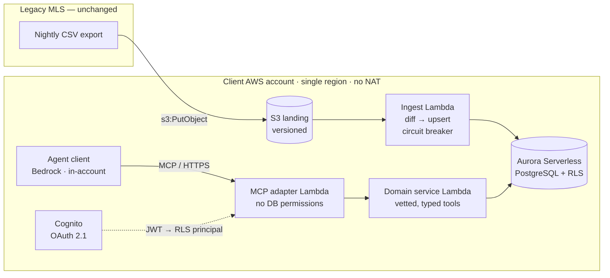

# Architecture Review — Natural-language agent over legacy real-estate data via MCP

**Industry:** Real estate. The legacy system is an MLS — the cooperative listing database US
brokerages run, typically decades old, with a nightly batch export as its canonical
integration path. The scenario is the industry's default shape, not a hypothetical.

---

## Assumptions I am making explicit

The brief leaves one thing unspecified that changes almost every downstream decision, so I
am stating my reading rather than assuming silently.

**The export is a CSV of structured records.** The evidence: *"full **data dump**"*, *"~3
million **records**"*, *"searches it **in memory**"*. "Records" is the decisive word — nobody
calls a PDF a record.

**Therefore the corpus has no substantive free text.** This is why my proposal removes vector
search entirely. If that assumption is wrong, see the trigger table in §2 — I have designed
for the fork rather than guessing.

**This is the first question I would put to the client**, ahead of any code.

---

## 1. What's wrong

Four of the five listed problems are the same mistake wearing different hats:

> **The draft has no boundary between ingest and serving. It treats the nightly export file
> as if it were the database.**

The scan, the latency, the cost and the re-embedding are all symptoms of that one missing
seam. Below, ranked by severity, with a confidence grade — because they are not equally
damning, and saying so is part of the review.

### P1 · Vector search does not belong here at all — **high confidence** · *not on your list*

The listed flaw is "embeddings are regenerated on every query," which frames it as a caching
bug. It is upstream of that: a **category error**.

> *NL interface ⇒ RAG ⇒ vector search.*

For a structured corpus the correct chain is **NL interface ⇒ text-to-SQL over vetted,
parameterized tools**. The model translates language into a *function call*, not a vector.

Embedding `{price: 450000, beds: 3, city: "Austin"}` converts exact, queryable facts into
fuzzy similarity — losing precision and gaining nothing. Vector search will happily return a
$530k listing whose text embedded similarly. For a compliance-sensitive client,
confidently-wrong is a worse failure than no answer. And *"which listings mention foundation
problems"* is unanswerable by any technology when there is no text in the corpus.

This makes the cost figure below land harder: it is not overspending on a poorly-implemented
feature, but on a feature **that should not exist**.

### P2 · Loading the whole dump per query — **high confidence**

Not slow. **Inoperable.**

A 3 GB CSV parsed into Python objects becomes **15–30 GB in RAM** (3–10× `dict`/`str`
overhead) against Lambda's 10 GB ceiling. The trap is that the on-disk file looks like it
fits. And at +5%/month the corpus doubles every ~14 months — 3M → 5.4M in a year, 9.7M in
two — so anything marginal today is scheduled to fail.

Three consequences worth naming:

- **CSV forbids partial reads.** No schema, types, index or compression. Every byte is parsed
  even to answer *"how many listings in Austin"* — no column pruning, no predicate pushdown,
  because the format cannot support them.
- **Latency is bimodal, not merely high.** Lambda reuses execution contexts, so some queries
  hit warm (~200 ms) and others cold-start (~40 s). For a conversational interface that is
  worse than uniform slowness — the user never learns "it's slow," only "it sometimes hangs."
- **The waste is priceable.** 10 GB × ~40 s = 400 GB-s ≈ **$0.007/query** just to load the
  file. At 1,000 queries/day, **~$210/month** re-reading a file unchanged since the overnight
  batch.

### P3 · Re-embedding per query — **high confidence** *(downstream of P1 and P2)*

3M × ~150 tokens ≈ 450M tokens per query. At Titan Text Embeddings V2 ($0.02/1M) that is
**~$9 for a single user question** — roughly the *monthly* infra cost of the corrected
design, burned on one query. Latency is hours, not seconds.

The structural reason matters more than the arithmetic: **the draft has no persistent store
anywhere** — just a file and Lambda RAM that evaporates at invocation end. There is nowhere
for pre-computed embeddings to live, so re-embedding is *forced* by the missing store. P3 is
a consequence of P2, not an independent defect.

### P4 · "Auth later" — **high confidence**

Wrong in three independent ways:

1. **It is not middleware, it is a data-layer property.** Which records a user may see is a
   filter inside every query path. Retrofitting it is not adding a layer — it is rewriting
   the data access layer you just built.
2. **An unauthenticated MCP server is a network-exposed exfiltration endpoint** for 3M
   confidential records. That is not "demo debt" in a compliance-bound vertical.
3. **The demo's real audience is the compliance team.** Shipping without auth loses the
   approval the shortcut was meant to buy.

The deeper point: the agent must act *as the end user*, not as a god-mode service account.
Otherwise it is a **confused deputy** — the model induced into fetching data the caller was
never entitled to. The MCP specification names token-passthrough confused-deputy explicitly
and forbids it.

> **The rule I would hold:** the authorization predicate is derived server-side from the
> authenticated principal, and is **never** a tool parameter the model can set.

### P5 · MCP server fused with business logic — **medium confidence; a judgment call**

I grade this one lower deliberately. The reflex justification — "separation of concerns,"
"different deployment cadence" — invites a fair objection: *small team, MVP, you want two
services and a network hop for a boundary a module import already gives you?* Splitting on
principle is premature decomposition.

**The flaw is *no seam*, not *same Lambda*.** What genuinely forces separation here:

- **Single-consumer lock-in.** Capabilities reachable only by speaking MCP: no web UI, no
  nightly report, no second agent, no testing domain logic without a protocol session. In a
  real brokerage there will be a dashboard within six months needing the same query layer.
- **Security boundary.** Transport code parsing untrusted input shares an execution context
  *and IAM role* with data access. Split, the adapter holds no data permissions of its own.
- **Protocol churn.** MCP has shipped meaningful transport and auth revisions inside a year.

What I would propose is **a hard module boundary on day one**; whether it deploys as a
separate process is a topology decision driven by the security boundary and consumer count,
not by principle. From that seam, splitting later is a config change rather than a rewrite.

### P6 · Two silent omissions — **high confidence**

- **No write path.** The brief says query **and act on**. The legacy system is read-only
  batch. The draft has no answer to where writes go.
- **No freshness handling.** Data is up to 24h stale and nothing surfaces it, so the agent
  will state yesterday's prices as current fact.

### The compliance trap that isn't in the diagram

**The MCP server never calls an LLM — the client does.** Raw records therefore leave the
account at the *client* boundary, not the server boundary. A flawless server architecture
plus Claude Desktop on an agent's laptop violates the residency constraint completely. **The
agent client must also run in-account.**

---

## 2. What I propose

### What stays

More than you might expect — the draft's instincts were not all wrong.

- **The nightly batch export to S3.** It is the only interface that exists, and it is a
  perfectly good *ingest* mechanism. The sin was using it as a *serving* mechanism.
- **S3 as the landing zone.** Cheap, durable, versioned; it gives a replayable audit trail
  and lets the serving layer be rebuilt from scratch at any time.
- **Lambda** — just not one monolith.
- **MCP** as the exposure protocol.

### What changes

| Draft | Fixed | Why |
|---|---|---|
| The dump *is* the database | Nightly pipeline: land → diff → upsert | Restores the missing seam |
| Vector search over structured rows | **Deleted.** Text-to-SQL over vetted tools | Precision; the category error |
| Re-embed everything per query | No embeddings at all | ~$9/query → $0 |
| In-memory linear scan | Aurora Serverless PostgreSQL, indexed | Sub-200 ms, in-VPC, in-region |
| Auth "later" | OAuth 2.1 → JWT → RLS, day one | Authz is a data-layer property |
| MCP == business logic | Module seam; thin adapter over a domain service | Reuse, testability, blast radius |
| No writes | Outbox + approval workflow | "Act on" needs an actual path |
| Silent staleness | `as_of` on every tool response | Trust |

**Diff at ingest is what makes the economics work.** The export is a full dump, but it is
compared against the previous snapshot so only changes are processed — roughly 15k–60k
records a night at realistic churn.

**Text-to-SQL does not mean the model writes SQL.** It selects among vetted, parameterized
tools (`search_listings`, `market_stats`, `flag_listing`) and fills typed arguments.
Free-form SQL generation brings hallucinated joins, wrong column semantics, unbounded scans,
and an authorization hole — a model writing its own `WHERE` can omit the tenant filter. If
open-ended analytics are genuinely needed later, I would add generated SQL as an explicit
escape hatch (read-only role, statement timeout, row cap, forced RLS, logged and replayable)
— never as the default path.

### The write path, since the brief asks for "act on"

Writes never reach the legacy system synchronously — there is no API. So actions split in two:

- **Actions that complete in the new system** (flag a listing, create a task, draft outreach)
  — full CRUD, immediate.
- **Actions that must reach the legacy system** — queued to an outbox for the batch
  write-back window, with status surfaced back to the user.

Consequential writes return **"pending approval," not "done."** In a compliance-bound
vertical, an agent that autonomously mutates the system of record is a non-starter.

### If my format assumption is wrong

| Corpus | Solution |
|---|---|
| Structured only *(my assumption)* | Relational + text-to-SQL. Zero embeddings. `pg_trgm` for fuzzy address/name matching — native, cheap, explainable. |
| Free text present (`PublicRemarks` / `PrivateRemarks` per the RESO Data Dictionary — likely in a *real* MLS feed) | `CREATE EXTENSION vector` + one column + one index, embedded **once at ingest**, never per query. |
| Documents in scope (PDF disclosures, inspections) | Extraction + chunking pipeline; re-evaluate the store past ~10M chunks. |

**This is the real reason I chose PostgreSQL** — stronger than any benchmark. It keeps the
vector decision **reversible at zero cost**. If text appears, it is an extension and a
column. If it never appears, we never paid for a vector database. A dedicated vector store
forces that decision up front, on a corpus that may never warrant it. (Residency also rules
out SaaS vector DBs outright — raw records would leave the account.)

### One thing I would negotiate

The constraint says the legacy system exposes no real-time API. It does **not** say we cannot
influence what goes *inside* the nightly file. Asking for **Parquet** (5–10× smaller, typed,
predicate pushdown) or simply for an **`updated_at` column** turns CDC from snapshot-diffing
into a trivial filter. Cheap, and usually unasked.

---

## 3. Guardrails

The budget cap is a constraint, so cost control belongs in the architecture, not in a runbook.

**Cost**
- AWS Budgets alarm with SNS notification
- **Max ACU ceiling on Aurora** — an uncapped maximum is how a five-figure surprise happens
- Lambda reserved concurrency, bounding runaway invocations
- S3 lifecycle on nightly dumps — do not retain 90 full snapshots forever
- **Cache TTL to the next batch load.** Data changes once a night, so a 24-hour TTL is
  normally reckless and here is *provably correct*. The constraint everyone reads as a
  limitation is the cost lever.
- **No NAT Gateway** — VPC endpoints only. Saves ~$32/mo *and* keeps traffic off the public
  internet, which is itself the residency argument.
- Cost-allocation tags for per-tenant attribution

**Security**
- Least-privilege separated IAM roles — the MCP adapter's role cannot reach the database
- Row-level security keyed to the authenticated principal
- No raw SQL surface
- Human approval on consequential writes
- Statement timeout and row cap on every query
- Audit log of every tool call: who, what, when, what came back
- Bedrock Guardrails for content and PII filtering

**Operational**
- **Ingest circuit breaker.** If the nightly diff exceeds a threshold percentage of records,
  halt and alert rather than process. A corrupt or truncated export must not silently
  overwrite the corpus. This is the guardrail that only appears in systems whose owners have
  been burned once.

---

## 4. Cost and latency

| Line item | Monthly |
|---|---|
| Aurora Serverless (0.5–2 ACU) | ~$45–150 |
| S3 (~5 GB + snapshots) | <$5 |
| Lambda (adapter, domain, ingest) | ~$10–30 |
| Embeddings | **$0** — removed |
| NAT Gateway | **$0** — VPC endpoints only |
| **Infra floor** | **~$60–185** |
| Bedrock inference | Dominant variable; scales with query volume and model tier |

| Latency stage | Estimate |
|---|---|
| MCP request + auth | ~50 ms |
| Indexed Postgres query over 3M rows | ~20–100 ms |
| **LLM generation** | **1–3 s** |

Once the data layer is fixed, **the LLM is 80–90% of response time and everything else is
noise.** That reframes where optimization effort belongs — and argues against gold-plating
the retrieval path.

*Figures are order-of-magnitude estimates to be re-verified at deployment region and time.*

---

## 5. The decisions I would defend hardest

**1 · Delete vector search.**
*Pushback: "but the brief specifies embeddings."* Structured records have no text to embed,
and vectorising exact facts destroys the precision the client actually needs. I have named
the exact trigger that brings it back, and the store choice keeps that reversal free. This is
the boldest call in the proposal and the one I am most confident in.

**2 · Natural language is the interface, not the execution engine.**
*Pushback: "isn't the point that the AI understands language?"* The model chooses which
vetted tool to call and with what typed arguments. It does not author the query. "Under
$500k" must be exact, and an agent that is approximately right about price is worse than one
that declines to answer.

**3 · Authentication on day one, not after the demo.**
*Pushback: "it slows us down."* The authorization model determines the shape of the data
access layer; retrofitting it means rewriting that layer. And the demo's real audience is the
compliance team — a demo without auth does not get the approval it was built to win.

---

## 6. Prior MCP integration

> **[TO BE COMPLETED — this is your own experience and I will not invent it.]**
>
> Name one real integration, what system it fronted, what the tools exposed, who consumed it,
> and one thing that turned out harder than expected. If it was not literally MCP — an agent
> wired to an internal system, tool-calling over a legacy API, a function-calling layer over a
> database — say so plainly and describe the equivalence. Named specifics beat protocol
> purity.

---

## 7. How I would structure the first two weeks

The plan is organised around **de-risking the unknowns**, not shipping features. Two things
can invalidate the architecture, and both are answerable in days.

### Week 1 — Kill the ambiguity, prove one path end to end

| Day | Focus |
|---|---|
| 1 | **The compliance ruling.** Does "never leaves our account" permit Bedrock — in-region, AWS-managed, outside their VPC? PrivateLink solves the network path; this is a legal judgment, not an engineering one. Get it in writing. Same conversation: **the client-side boundary** — the agent client must run in-account too. |
| 1–2 | **The export.** Get a real file. Profile it: actual size, actual schema, actual free-text fields, actual churn between two consecutive nights. Negotiate Parquet and `updated_at` while the relationship is fresh. This single artifact confirms or kills the assumptions in this document. |
| 2–3 | **Auth and schema together**, because they are the same decision. Tenancy model, RLS policy, JWT claim mapping. |
| 3–5 | **One authenticated vertical slice**: one tool, one query, real data, real identity, end to end. Not a mock. |

Exit criterion: a compliance officer could look at the slice and say yes or no.

### Week 2 — Correctness, the write path, and cost visibility

| Day | Focus |
|---|---|
| 6–7 | **Golden question set** — ~25 real questions from actual brokerage staff, with known-correct answers. This becomes the regression suite and settles arguments about retrieval quality with evidence instead of opinion. |
| 7–8 | **Ingest hardening**: full CDC, the circuit breaker, metrics on records changed and cost per run. |
| 8–9 | **The write path**: outbox, approval workflow, status surfaced back to the agent. |
| 9 | **Cost instrumentation and guardrails** wired into IaC — budget alarm, ACU ceiling, concurrency limits, all asserted in tests rather than merely configured. |
| 10 | **Demo to the compliance team, not just the sponsor.** They are the ones who can stop this in month three. |

**Team shape:** two engineers (one data/ingest, one API/MCP), one part-time security or
compliance reviewer from day one rather than as a gate at the end. I would take the
architecture and the client conversations.

**What I would deliberately *not* do in two weeks:** multi-tenant onboarding, a UI, more than
a handful of tools, or any performance work beyond confirming the latency budget holds. The
goal at day 10 is a system that is *provably safe, provably correct on a known question set,
and honest about what it does not know* — not a broad one.
